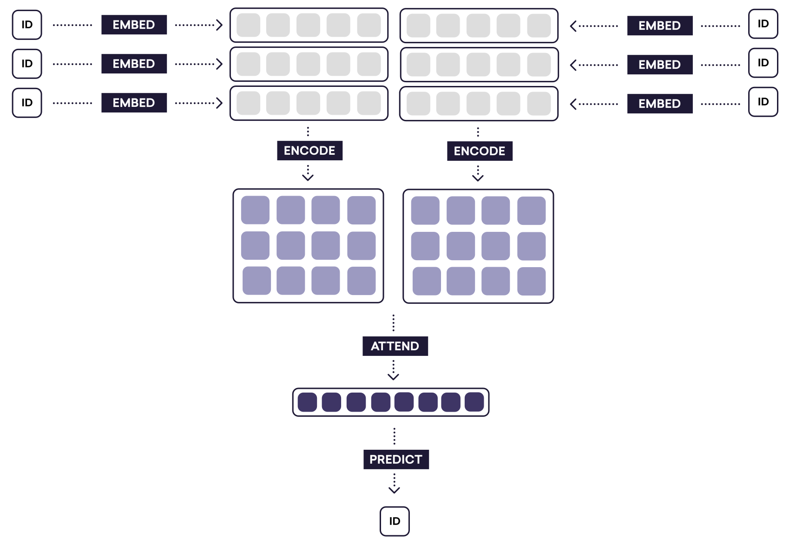

##  Hierarchical Attention Networks for Document Classification

We know that documents have a hierarchical structure, words combine to form sentences and sentences combine to form documents. [This paper](https://www.cs.cmu.edu/~diyiy/docs/naacl16.pdf) exploits that structure to build a classification model. This is an implementation of the model in PyTorch.

*Note:*  I did not include a bias term in doing the initial linear map of the attention network. If I included that term, I was not able to do backpropagation. I am hoping to fix it, suggestions are welcome.

This picture from [Explosion blog](https://explosion.ai/blog/deep-learning-formula-nlp) explains the structure perfectly.

### Notebook

The notebook contains an example of trained model on IMDB movie review dataset. I did not do any hyperparameter tuning or validation checks. Here is the training loss plot on the same dataset.

