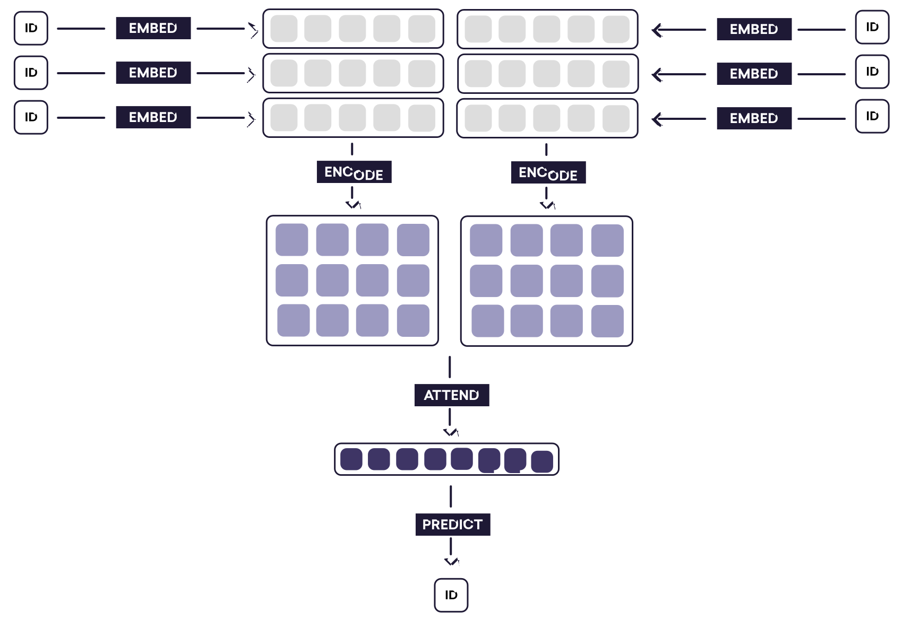
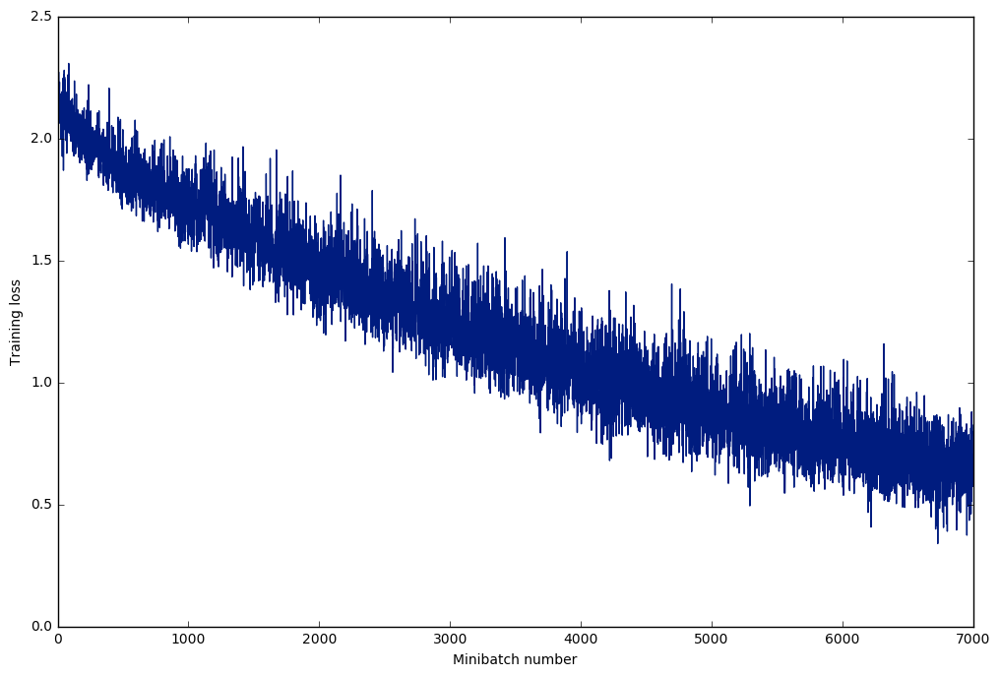

##  Hierarchical Attention Networks for Document Classification

We know that documents have a hierarchical structure, words combine to form sentences and sentences combine to form documents. We can try to learn that structure or we can input this hierarchical structure into the model and see if it improves the performance of existing models. [This paper](https://www.cs.cmu.edu/~diyiy/docs/naacl16.pdf) exploits that structure to build a classification model. 

This is an (close) implementation of the model in PyTorch. 

### Note:

1. I jointly optimize both the word and sentence attention models with the same optimizer.
2. The minibatches are padded with zeros. This can be improved, one can sort senteces with similar length together, and minimize the paddings.
3. Pytorch does not yet support gradient masking, so padded zeros will have gradients flowing through them during backpropagation. One can create a mask, but since I am interested in using Bidirectional GRU, it is not possible to use a mask. I've seen that variable length RNN supoort is coming soon to Pytorch as well.

This picture from [Explosion blog](https://explosion.ai/blog/deep-learning-formula-nlp) explains the structure perfectly.

### Notebook

The notebook contains an example of trained model on IMDB movie review dataset. I could not get the original IMDB dataset that the paper referred to, so I have used [this data](http://ir.hit.edu.cn/~dytang/paper/acl2015/dataset.7z)

The best accuracy that I got was around ~ 0.35. This dataset has only 84919 samples and 10 classes. Here is the training loss for the dataset. 

